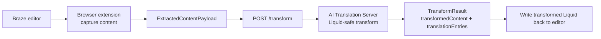

# Architecture

## Product Shape

The POC is split into two primary applications plus shared packages:

1. Browser Extension
   - runs on Braze pages
   - captures editor content conservatively
   - calls the server with shared schemas
   - keeps UI, detection, and display logic in the browser
2. AI Translation Server
   - owns Liquid-safe transforms
   - owns translation orchestration and validation
   - owns Braze retrieval and Braze sync boundaries
   - keeps all secrets and external integrations off the client
3. Shared packages
   - provide the contract and deterministic logic both apps depend on

## Browser Extension

The extension is intentionally thin. It is responsible for:

- detecting supported Braze pages
- capturing editor content into `ExtractedContentPayload`
- sending that payload to `POST /transform`
- rendering debug and review output for the operator

The extension must not:

- hold OpenAI or Braze secrets
- implement translation logic
- rewrite Liquid directly
- invent request or response payloads outside `packages/schemas`

## AI Translation Server

The server is the system of record for business logic. It is responsible for:

- transforming source content into localization-ready Liquid placeholders
- extracting and validating `TranslationEntry` records
- translating missing locale values
- validating AI output before it can move toward Braze
- retrieving template translation data from Braze
- syncing translated values back to Braze
- exporting or importing CSV data when needed

The server owns the route surface and the higher-level workflow contracts.

## Shared Contracts

`packages/schemas` contains the shared runtime contracts used across the POC:

- editor preparation contracts
  - `ExtractedContentPayload`
  - `TranslationEntry`
  - `TransformResult`
- template translation orchestration contracts
  - `TemplateTranslateRequest`
  - `TemplateTranslateResponse`
  - `TemplateTranslationRequest`
  - `TemplateTranslationResult`
  - `TranslationSummary`
  - `BrazeTemplateSourceData`
  - `BrazeTemplatePushRequest`
  - `BrazeTemplatePushResult`
- server-side building block contracts
  - `TranslationRequest`
  - `TranslationResponse`
  - `CsvExportRequest` / `CsvExportResponse`
  - `CsvImportRequest` / `CsvImportResponse`
  - `BrazeSyncRequest` / `BrazeSyncResult`

## POC Workflows

### Editor Preparation Flow

This workflow prepares a Braze editor template for localization.

Notes:

- The transform output now uses incremental Braze translation blocks such as
  `...`.
- The current extension MVP already captures content, shows the returned
  `TransformResult`, and can apply that transformed content back into supported
  Braze editor surfaces.
- Generic page fallback remains read-only and does not apply transformed
  content back into the page.

### Template ID Translation Flow

This workflow fills missing locale values for an existing Braze template.

```mermaid
flowchart LR
  template["Template ID"] --> request["TemplateTranslateRequest"]
  request --> server["AI Translation Server"]
  server --> brazeRead["Retrieve template translation data from Braze"]
  brazeRead --> missing["Find missing locale values"]
  missing --> translate["Translate and validate strings"]
  translate --> brazeWrite["Push translated values back to Braze"]
  brazeWrite --> result["TemplateTranslateResponse<br/>summary + validationErrors"]
```

Notes:

- `TemplateTranslateRequest` and `TemplateTranslateResponse` are the public
  backend route contracts for this workflow.
- `TemplateTranslationRequest`, `TemplateTranslationResult`,
  `BrazeTemplateSourceData`, and `BrazeTemplatePush*` remain the richer shared
  workflow contracts behind that route.
- `TemplateTranslateResponse` reports summary counts plus validation errors.
- The current backend implementation already has the lower-level translation,
  CSV, and mock Braze sync contracts needed for this flow.

## Package Responsibilities

- `packages/schemas`
  - shared `zod` contracts and inferred TypeScript types
- `packages/liquid-engine`
  - deterministic parsing, extraction, and placeholder insertion
- `packages/csv-utils`
  - CSV serialization and parsing helpers for the server

## Non-negotiables

- existing Liquid must be preserved exactly
- ambiguous content must fail safely
- every transform must remain reversible or diffable
- no raw LLM output may move toward Braze without validation
- no OpenAI or Braze secret may live in the browser extension
